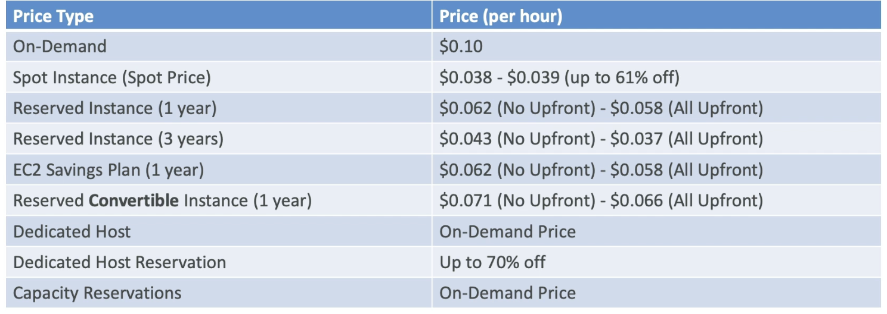

# ch5
---
## EC2
- EC2 is one of the most popular services in AWS
- It mainly consists in the capability of:
  - Renting virtual machines (EC2)
  - Storing data on virtual drives (EBS)
  - Distributing load across machines (ELB)
  - Scaling the services using an auto-scaling group (ASG)

## EC2 sizing & configuration types
- Operating system
- How much power (CPU)
- How much RAM
- How much disk space
  - Network-attached (EBS & EFS)
  - hardware (EC2 instance store)
- Network card
  - Speed of the card
  - Public IP address
  - Firewall rules (security groups)
- Bootstrap script / User data
  - Launch commands on the instance at first start
  - Ex: installing updates, downloading common files from the internet

## EC2 User Data
- It is possible to bootstrap our instances using an EC2 User Data script
- bootstrapping means launching commands when a machine starts
- That script is only run once at the instance first start
- EC2 User Data is used to automate boot tasks such as:
  - Installing updates
  - Installing software
  - Downloading common files from the internet
  - Anything you can think of
- The EC2 User Data Script runs with the root user

## EC2 Instance types
- Each instance type has different characteristics and pricing
- T-series:
  - Burstable performance
  - Great for web servers & small DBs
- C-series:
  - Compute optimized
  - Great for CPU intensive tasks / DBs
- R-series:
  - Memory optimized
  - Great for memory intensive tasks / DBs
- M-series:
  - Balanced
  - Great for general purpose apps
- A-series:
  - Arm-based workloads
- F-series:
  - Accelerated computing
  - Great for machine learning, data science, etc...
- P-series:
- GPU instances

## EC2 Instance Types Overview
- AWS has the following naming convention:
> m5.2xlarge
> - m: instance class
> - 5: generation(AWS improves the hardware generation every 12-18 months)
> 2xlarge: size within the instance class

## EC2 Instance Types - General Purpose
- Great for a diversity of workloads such as:
  - Small & medium databases
  - Data processing tasks
  - Backend servers
  - Caching fleets
  - Application servers

## EC2 Instance Types - Compute Optimized
- Great for compute-bound applications that benefit from high performance processors
  - Batch processing workloads
  - Media transcoding
  - High performance web servers
  - High performance computing (HPC)
  - Scientific modeling & machine learning
  - Dedicated gaming servers

## EC2 Instance Types - Memory Optimized
- Great for memory-bound applications that require high performance processors
  - High performance databases
  - Distributed web scale cache stores
  - In-memory databases optimized for BI
  - Applications performing real-time processing of big unstructured data

## EC2 Instance Types - Storage Optimized
- Great for storage-intensive tasks that require high, sequential read and write access to large data sets on local storage
  - High frequency online transaction processing (OLTP) systems
  - Relational & NoSQL databases
  - Data warehousing applications
  - Distributed file systems
  - Log or data processing applications

## Security Groups Good to know
- Can be attached to multiple instances
- Locked down to a region / VPC combination
- Does live "outside" the EC2 - if traffic is blocked the EC2 instance won't see it
- It's good to maintain one separate security group for SSH access
- If your application is not accessible (time out):
  - Check security groups (normally it's that)
  - Check network ACLs
  - Check if your instance is in a private subnet with a NAT gateway
  - Check your "public" subnet route table
  - Check your instance logs
- If your application gives a "connection refused" error:
  - Check if your application is running
  - Check if your application is listening on the correct port
  - Check your instance logs
- All inbound traffic is blocked by default
- All outbound traffic is authorized by default

## Classic Ports to know
- 22: SSH (Secure Shell) - log into a Linux instance
- 21: FTP (File Transfer Protocol) - upload files into a file share
- 22: SFTP (Secure File Transfer Protocol) - upload files using SSH
- 80: HTTP - access unsecured websites
- 443: HTTPS - access secured websites
- 3389: RDP (Remote Desktop Protocol) - log into a Windows instance

## EC2 Instance Connect
- Will upload a temporary SSH key to your EC2 instance

## EC2 Instance IAM Roles
- **Never use your root account credentials on ec2 instance**
- Instead, create an IAM role and assign it to your EC2 instance
- The role should have the right permissions to do what you need to do

## EC2 Instance Purchasing Options
- On-demand instances:
  - short workload, predictable pricing
  - pay for what you use (billing per second after the first minute)
  - Has the highest cost but no upfront payment
  - No long-term commitment
  - Recommended for short-term and un-interrupted workloads, where you can't predict how the application will behave
- Reserved instances:
  - Long workloads
  - Predictable usage
  - Up to 75% discount compared to On-demand
  - Pay upfront for what you use
  - Reservation period can be 1 or 3 years
  - Reserve a specific instance type
  - Recommended for long-term and steady state usage applications (think database)
- Spot instances:
  - short workloads, for cheap, but can lose instances (if the max price is less than the current spot price)
- Dedicated Hosts:
  - book an entire physical server, control instance placement
- Dedicated Instances:
  - no other customers will share your hardware
- Capacity Reservations:
  - reserve capacity for your EC2 instances in a specific AZ

## EC2 Instance On-Demand
- Pay for what you use
  - Linux/Windows: billing per second, with a minimum of 60 seconds
  - All other OS: billing per hour
- has the highest cost but no upfront payment
- no long-term commitment
- Recommended for short-term and un-interrupted workloads, where you can't predict how the application will behave

## EC2 Reserved Instances
- Up to 72% discount compared to On-demand
- you reserve a specific instance attribute (type, Region, Tenancy, OS)
- Reservation period can be 1 or 3 years

## EC2 Savings Plans
- Up to 72% discount compared to On-demand

## EC2 Spot Instances
- Can get a discount of up to 90% compared to On-demand
- Instances that you can "lose" at any point of time if your max price is less than the current spot price
- Most Cost-efficient instances in AWS

## Useful for workloads that are resilient to failure
- Big data and containerized workloads
- Any Distributed workload

## EC2 Dedicated Hosts
- Physical dedicated EC2 server for your use
- Allow you address compliance requirements

- suitable for regulatory requirements that may not support multi-tenant virtualization

## EC2 Dedicated Instances
- Instances running on hardware that's dedicated to you

- suitable for regulatory requirements and licensing that does not support multi-tenant virtualization

## EC2 Capacity Reservations
- Reserve capacity for your EC2 instances in a specific AZ
- No time commitment, no billing discount

- suitable for short-term, uniterupted workloads that need to launch in a specific AZ

## Which purchasing option is right for you?
- On-demand:
  - short-term, un-interrupted workloads, where you can't predict how the application will behave
- Reserved:
  - Recommended for long-term and steady state usage applications (think database)
- Savings Plans:
  - Great for flexible usage, but still long-term commitment
- Spot:
  - Great for cost optimization, and fault-tolerant and flexible applications (think big data and containerized workloads)
- 

## Shared Responsibility Model for EC2
- AWS is responsible for the infrastructure that runs EC2
- You are responsible for the security of the EC2 instance

## EC2 - Summary
- EC2 instance: AMI + Instance Type + User Data + Storage + Security Group + SSH Key Pair